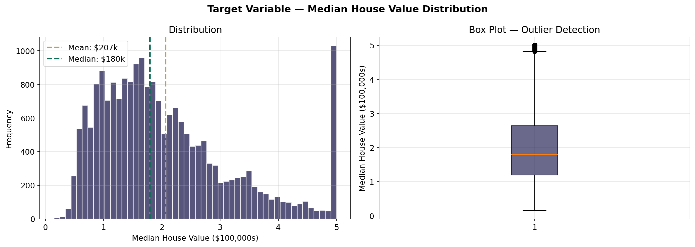
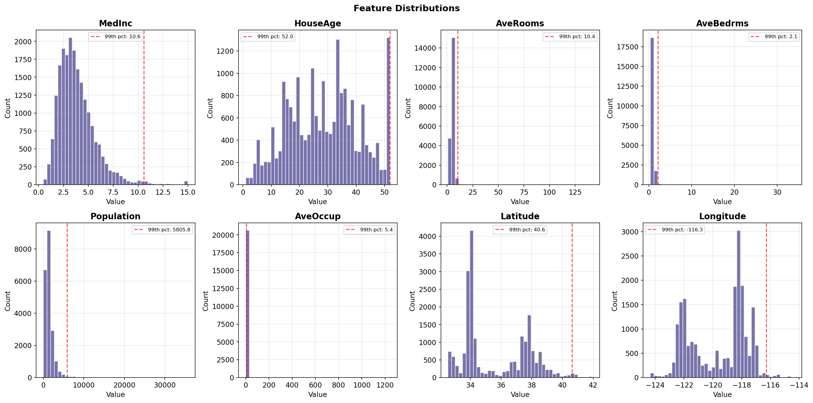
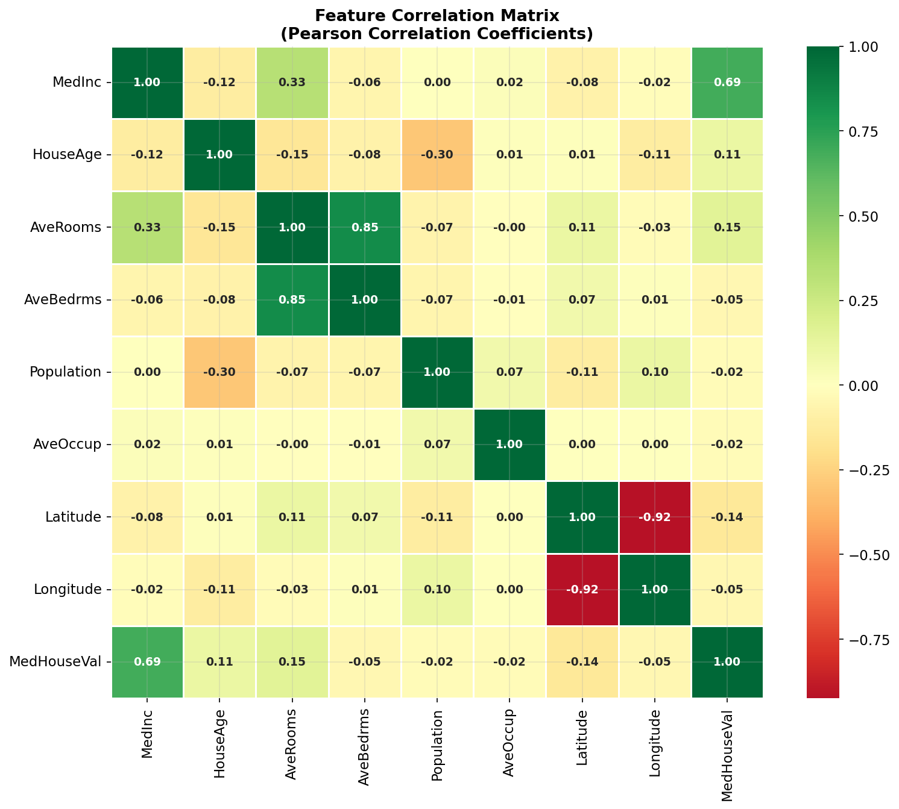
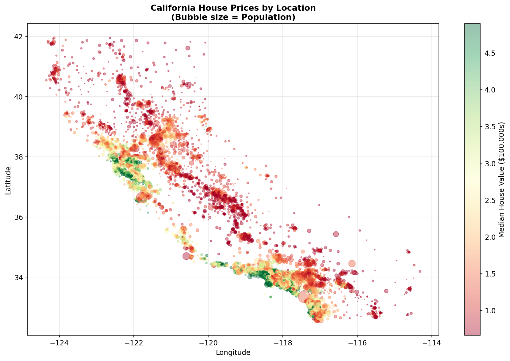
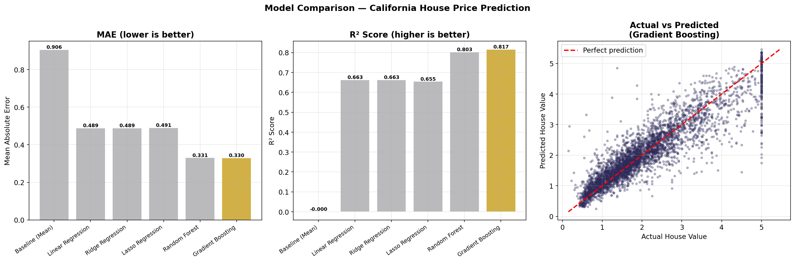
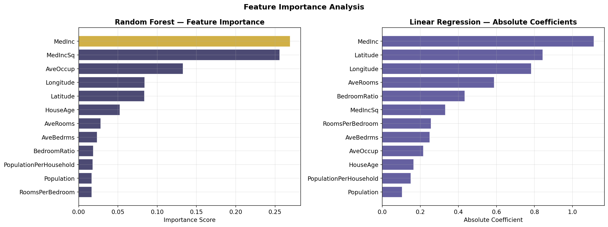
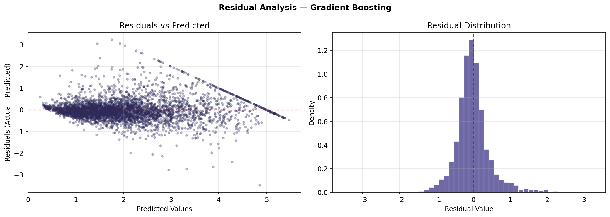

# California House Price Prediction

Predicting median house values for California districts using the classic
[California Housing dataset](https://scikit-learn.org/stable/datasets/real_world.html#california-housing-dataset)
(loaded via `sklearn.datasets.fetch_california_housing`). A supervised
regression problem, solved and compared across six modeling approaches.

## Problem Statement

Predict `MedHouseVal` — the median house value for a California census
block group (in $100,000s) — from 8 demographic and geographic features.

**Evaluation metrics:**
- **MAE** (Mean Absolute Error) — primary metric, directly interpretable in dollars
- **RMSE** — penalizes large errors more heavily
- **R²** — proportion of variance explained

## Results

| Model | MAE | RMSE | R² |
|---|---|---|---|
| Baseline (Mean) | 0.9061 | 1.1449 | -0.0002 |
| Linear Regression | 0.4894 | 0.6646 | 0.6629 |
| Ridge Regression | 0.4893 | 0.6646 | 0.6629 |
| Lasso Regression | 0.4906 | 0.6724 | 0.6549 |
| Random Forest | 0.3308 | 0.5084 | 0.8028 |
| **Gradient Boosting** | **0.3300** | **0.4899** | **0.8168** |

**Best model: Gradient Boosting** — MAE of 0.3300 (~$33k average error),
explaining 81.7% of variance, a 63.6% improvement over the mean baseline.
Confirmed with 5-fold cross-validation (CV MAE: 0.3282 ± 0.0051).

Top predictive features: `MedInc` (median income), `MedIncSq` (engineered,
captures non-linear income effect), and `AveOccup` (average occupancy).

See [notebooks/House_PRICE.ipynb](notebooks/House_PRICE.ipynb) for the full
analysis and reasoning behind each modeling decision.

## Approach

1. **EDA** — distributions, correlations, geographic patterns, outlier detection (IQR)
2. **Preprocessing** — winsorization of extreme outliers, feature engineering
   (`RoomsPerBedroom`, `BedroomRatio`, `PopulationPerHousehold`, `MedIncSq`),
   train/test split (80/20, random — no temporal ordering to worry about), feature scaling
3. **Modeling** — Linear Regression, Ridge, Lasso, Random Forest, Gradient
   Boosting, compared against a mean-prediction baseline
4. **Validation** — 5-fold cross-validation, residual analysis

## Visualizations

| | |
|---|---|
|  |  |
|  |  |
|  |  |
|  | |

## Try it: Streamlit app

A Streamlit app (`app.py`) serves live predictions from the trained
Gradient Boosting model — no retraining happens at request time; it loads
the pre-trained artifact at `model/artifact.joblib`.

```bash
pip install -r requirements.txt
streamlit run app.py
```

## Setup (notebook / EDA / retraining)

```bash
pip install -r requirements-dev.txt
jupyter notebook notebooks/House_PRICE.ipynb
```

The dataset is fetched automatically on first run (cached locally by
scikit-learn) — no manual data download needed. To regenerate
`model/artifact.joblib` after changing the training code, run
`python -m model.train`.

## Project Structure

```
.
├── app.py                    # Streamlit app (UI only — no ML logic)
├── model/
│   ├── train.py               # Reproduces the notebook's GBM training, saves the artifact
│   ├── inference.py            # predict_house_price() used by app.py
│   ├── pipeline.py             # Preprocessing + model bundled as one object
│   └── artifact.joblib          # Pre-trained model (committed, loaded at runtime)
├── .streamlit/
│   └── config.toml            # Streamlit theme
├── notebooks/
│   └── House_PRICE.ipynb      # Full analysis notebook
├── images/                    # Charts exported from the notebook
├── requirements.txt           # Runtime deps for the Streamlit app
├── requirements-dev.txt       # + notebook/EDA/retraining deps
└── README.md
```
